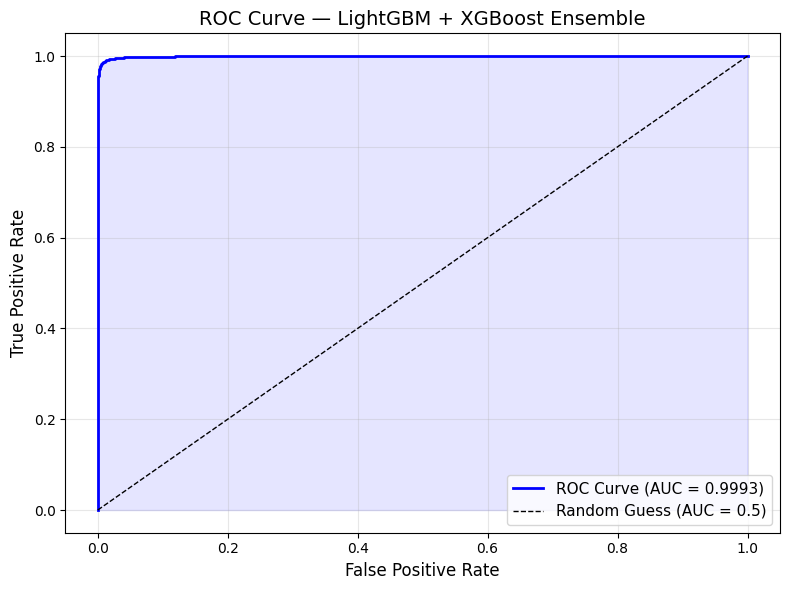

# alrIEEEna'26 ML Challenge: Binary Fault Detection

Hi! I'm Priyanshu from GEHU Dehradun, participating in the alrIEEEna'26 ML Challenge by IEEE Student Branch. This project focuses on binary fault detection using sensor data—super relevant for industrial IoT. I built an ensemble model that hit solid metrics. Dive in below!

## Problem Statement
Binary classification to detect faults from 47 numerical sensor features (F01–F47):  
- **Class 0**: Normal  
- **Class 1**: Faulty

## Dataset
Clean dataset with no missing values:

| Aspect                | Details                        |
|-----------------------|--------------------------------|
| **Training Samples**  | 43,038                         |
| **Test Samples**      | 10,944                         |
| **Features**          | 47 numerical                   |
| **Duplicates Removed**| 738                            |
| **Class Balance**     | 59.8% Normal, 40.2% Faulty     |

Slight imbalance required careful handling.

## Approach

### 1. EDA
- No nulls; removed 738 duplicates.
- Confirmed class split; distributions analysed across all 47 features.

### 2. Correlation Analysis
Pearson correlations with target:  
**Top 5**: F01 (0.383), F09 (0.373), F29 (0.360), F19 (0.355), F21 (0.344)  
**Weakest**: F41 (0.0001), F40 (0.003), F38 (0.004)  
26/47 features had > 0.10 correlation with target.

### 3. Feature Engineering
Added 17 features (total: 64):  
- Row stats: mean, std, max, min, range, skew, kurtosis  
- Block sums and means for 5 sensor groups (F01–F09, F10–F19, F20–F29, F30–F39, F40–F47)  
- Scaled with RobustScaler inside Sklearn Pipeline (prevents data leakage)

### 4. Modeling
Soft voting ensemble: **LightGBM + XGBoost**  
- LightGBM alone was tested first as baseline, then combined with XGBoost in a soft voting ensemble for better performance
- RobustScaler inside Sklearn Pipeline ensures no data leakage during cross validation
- class_weight='balanced' and scale_pos_weight used to handle class imbalance  
- Stratified 5-Fold Cross Validation for reliable evaluation  
- Optimal decision threshold: 0.36 (tuned via out-of-fold probability predictions)

## Results (5-Fold Stratified CV)

| Metric     | Score   |
|------------|---------|
| Accuracy   | 98.94%  |
| F1 Score   | 98.67%  |
| Precision  | 99.26%  |
| Recall     | 98.09%  |
| **AUC**    | **0.9993** |

---

## ROC Curve

> AUC = 0.9993 — The curve hugging the top-left corner confirms the 
> ensemble distinguishes Normal vs Faulty devices with near-perfect confidence.

---

Test predictions saved in `FINAL.csv`.

## Repository Files

| File | Description |
|------|-------------|
| `alrIEEEna26_ML_Challenge.ipynb` | Full notebook with EDA, feature engineering, training and evaluation |
| `FINAL.csv` | Final test predictions (10,944 rows, ID and CLASS columns) |
| `roc_curve.png` | ROC Curve of the ensemble model |
| `README.md` | This file |

## Setup & Run
1. Clone this repository
2. Install dependencies: pandas, scikit-learn, lightgbm, xgboost, numpy
3. Obtain TRAIN.csv and TEST.csv from the competition portal
4. Run the notebook end to end in Jupyter or Google Colab

> **Note:** TRAIN.csv and TEST.csv are provided by the competition portal 
> and are not included in this repository.

## Key Takeaway
Feature engineering was the game-changer in this project. Capturing 
subsystem-level sensor behaviour through block aggregations significantly 
improved model performance. Thanks IEEE GEHU for an amazing challenge!

*Priyanshu | GEHU Dehradun | March 2026*
